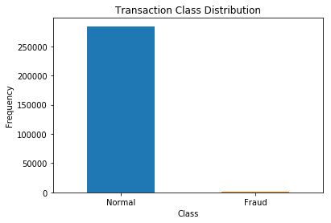
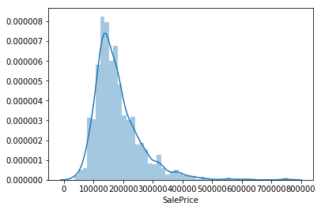
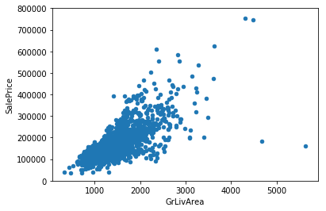

# Imports
```
import matplotlib.pyplot as plt
import seaboarn as sns
```

# Histogram
## Each parameter
```
data.hist(figsize=(20,20))
plt.show()
```

## Count plot

```
count_classes = pd.value_counts(data['Class'], sort = True)
count_classes.plot(kind = 'bar', rot=0)
plt.title("Transaction Class Distribution")
plt.xticks(range(2), LABELS)
plt.xlabel("Class")
plt.ylabel("Frequency");
```

It indicates an extremely imbalanced dataset.

More complex one
```
def catplot(data, col):
    ax = sns.catplot(x=col, hue="label", col="type",data=data, kind="count", height=5, legend=False, aspect=1.4)
    ax.set_titles("{col_name}")
    ax.add_legend(loc='upper right',labels=['normal','attack'])
    plt.show(ax)
```


## Dual plot 
```
def dual_plot(col, data1=normal, data2=anomaly, label1='normal', label2='anomaly'):
    sns.distplot(data1[col], label='normal', hist=False, rug=True)
    sns.distplot(data2[col], label='anomaly', hist=False, rug=True)
    plt.legend()
```


Seaborn [countplot](https://seaborn.pydata.org/generated/seaborn.countplot.html)
and [catplot](https://seaborn.pydata.org/generated/seaborn.catplot.html)

# Distribution plot
```
sns.distplot(df['price']);
```

A bit skewed than normal.

# Scatter Plot
## Continuous vs Continuous
```
data.plot.scatter(x="'GrLivArea'", y='SalePrice', ylim=(0,800000));
```

Semi linear and positive relationship. Though there are some outliers.

## All continuous features
```
fig = plt.figure(figsize = (20, 25))
j = 0
for i in data.columns:
    plt.subplot(6, 4, j+1)
    j += 1
    sns.distplot(data[i][result['diagnosis']==0], color='g', label = 'benign')
    sns.distplot(data[i][result['diagnosis']==1], color='r', label = 'malignant')
    plt.legend(loc='best')
fig.suptitle('Breast Cance Data Analysis')
fig.tight_layout()
fig.subplots_adjust(top=0.95)
plt.show()
```


## Comparing two vertically
```
f, (ax1, ax2) = plt.subplots(2, 1, sharex=True)
f.suptitle('Time of transaction vs Amount by class')
ax1.scatter(Fraud.Time, Fraud.Amount)
ax1.set_title('Fraud')
ax2.scatter(Normal.Time, Normal.Amount)
ax2.set_title('Normal')
plt.xlabel('Time (in Seconds)')
plt.ylabel('Amount')
plt.show()
```


# Boxplot
Can be used to visualized relation between continuous and discreet variables
```
var = 'OverallQual'
data = pd.concat([df_train['SalePrice'], df_train[var]], axis=1)
f, ax = plt.subplots(figsize=(8, 6))
fig = sns.boxplot(x=var, y="SalePrice", data=data)
fig.axis(ymin=0, ymax=800000);
```


#  Correlation matrix
```
correlation_matrix = data.corr()
fig = plt.figure(figsize=(12,9))
sns.heatmap(correlation_matrix,vmax=0.8,square = True)
plt.show()
```

Look for the most correlated zones except the diagonal position (same variables are
certainly correlated). If two different features are highly correlated, 
its better to drop one of them.  Here the 'TotalBsmtSF' and '1stFlrSF' variables 
are highly correlated.  Can you find any more ??

# Reference
* [Comprehensive data exploration with Python](https://www.kaggle.com/pmarcelino/comprehensive-data-exploration-with-python)